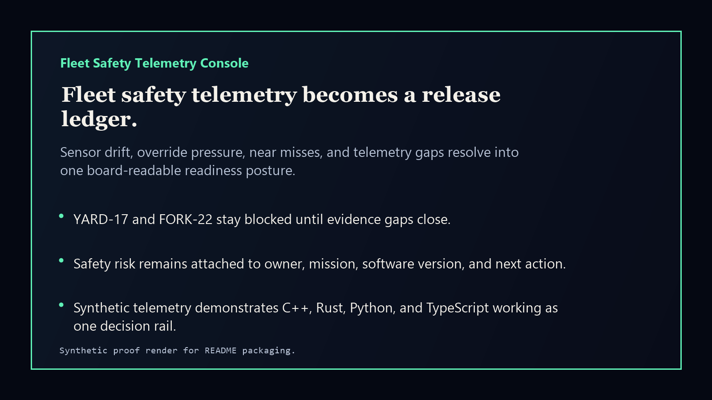
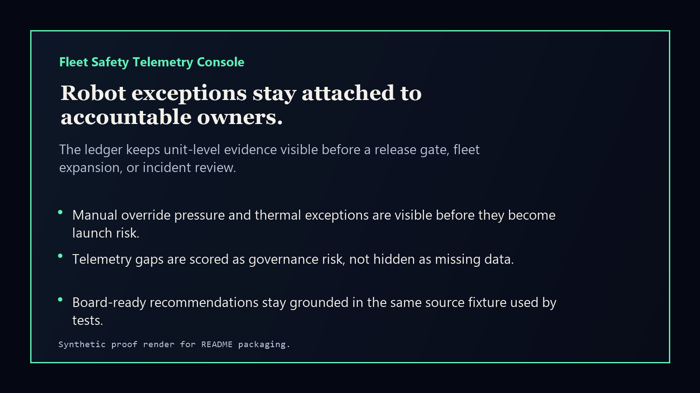

# fleet-safety-telemetry-console

[](https://github.com/mizcausevic-dev/fleet-safety-telemetry-console/actions/workflows/ci.yml)
[](https://github.com/mizcausevic-dev/fleet-safety-telemetry-console/actions/workflows/pages.yml)
[](LICENSE)

Fleet Safety Telemetry Console is an automotive and robotics control-plane prototype for turning sensor drift, override pressure, near misses, telemetry gaps, and thermal exceptions into a board-readable readiness ledger.

It is built to create clear portfolio signal across C++, Rust, Python, and TypeScript while staying aligned with the Kinetic Gain pattern: raw operational complexity becomes an evidence-backed decision surface.

## Why this exists

- Robotics and autonomous-fleet programs fail quietly when safety telemetry is fragmented across logs, CSVs, issue trackers, and launch reviews.
- Operators need a single owner-visible view before a release, pilot expansion, or fleet-retro decision.
- Boards need to know whether readiness risk is a real system problem, a temporary exception, or a governance gap.

## What it ships

- C++ embedded-style risk scorer for fleet telemetry records.
- Rust normalizer that converts telemetry into readiness events.
- Python incident-pack generator for safety review narratives.
- TypeScript scoring library, tests, CLI, and static web console.
- Synthetic fixtures, docs, screenshots, and GitHub Pages release rail.

## Routes

- `/` - static public console
- `/api/fleet` - JSON summary when run locally with Express

## Local run

```powershell
npm install
npm run verify
npm run prerender
npm run smoke
```

## CLI

```powershell
npm run demo
python python/fleet_safety_console/pack.py fixtures/fleet-telemetry.json --format markdown
clang++ -std=c++20 cpp/safety_score.cpp -o cpp/safety_score.exe
./cpp/safety_score.exe fixtures/fleet-telemetry.json
cargo test --manifest-path crates/fleet-normalizer/Cargo.toml
```

## Screenshots





## Security

This repo uses synthetic telemetry only. Do not commit VINs, precise GPS traces, proprietary autonomy logs, safety incident identifiers, customer data, credentials, or production fleet telemetry.

